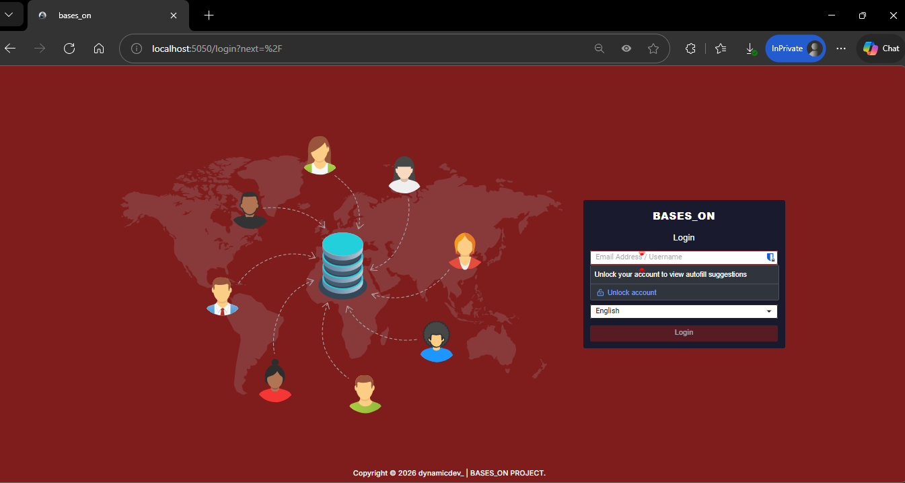
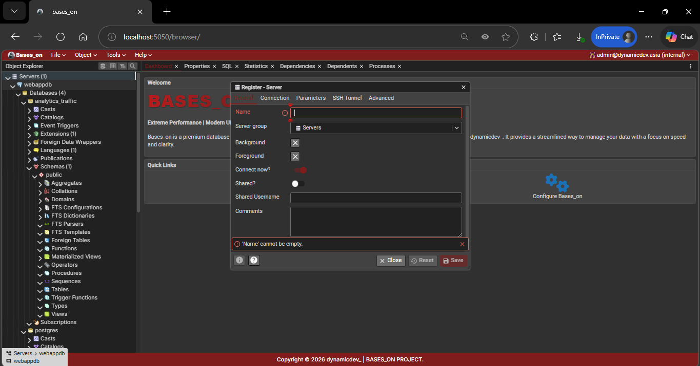
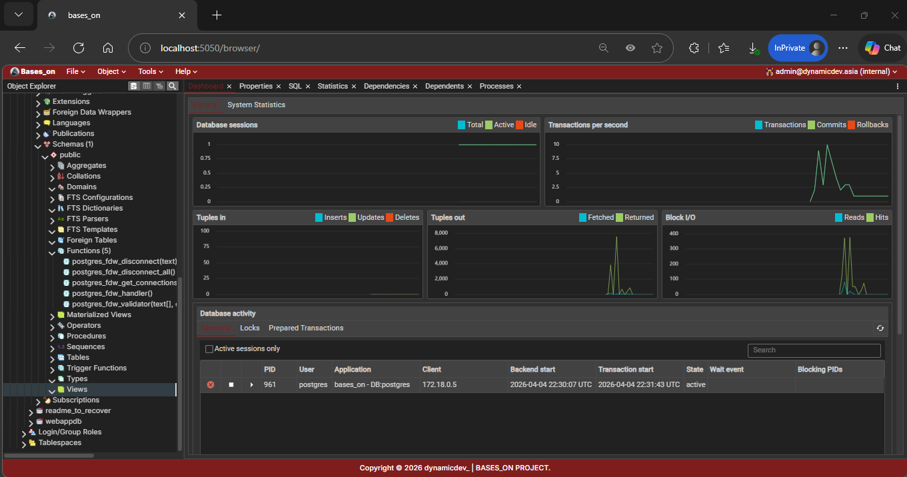
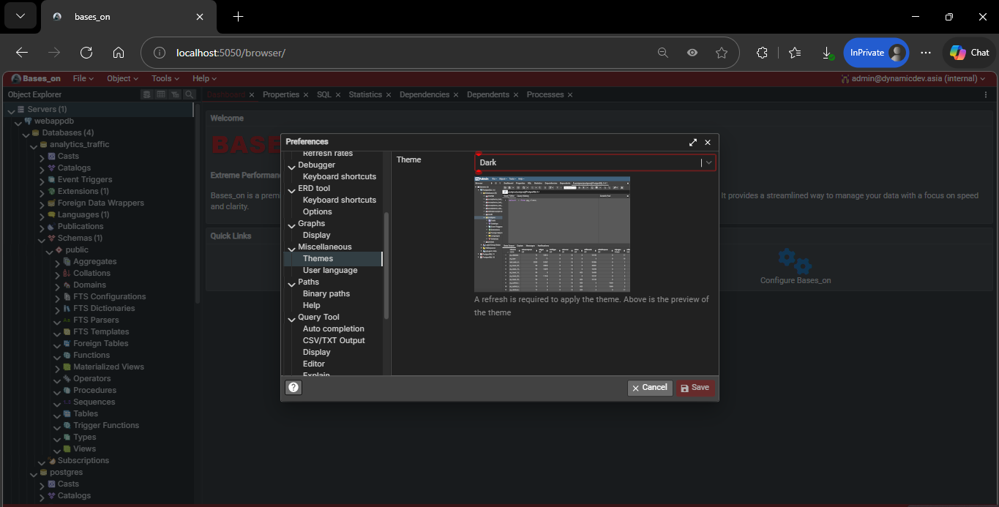
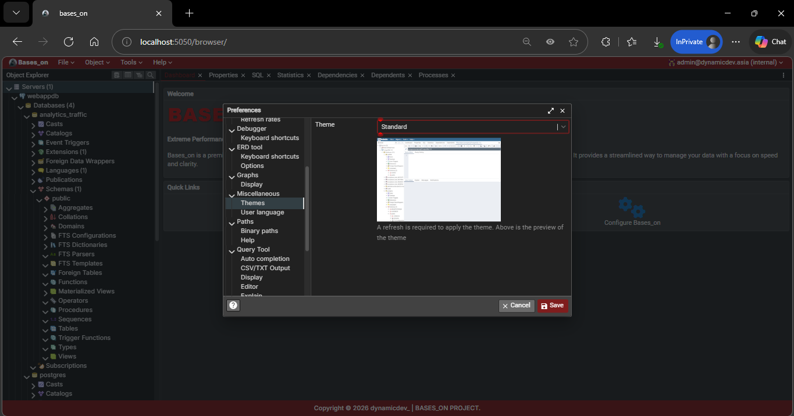

<div align="center">

# 📊 BASES_ON

### Extreme Performance | Modern UI | dynamicdev_ Standard

**A premium PostgreSQL database management interface — reimagined.**

[](./LICENSE)
[](https://hub.docker.com)
[](https://postgresql.org)
[](https://dynamicdev.asia)

---

**[Features](#-features) • [Quick Start](#-quick-start) • [Screenshots](#-screenshots) • [Documentation](#-documentation) • [License](#-license)**

</div>

---

## 🎯 What is bases_on?

**bases_on** is a battle-tested fork of [pgAdmin 4](https://github.com/pgadmin-org/pgadmin4) — the world's most advanced PostgreSQL administration tool — completely rebuilt with **dynamicdev_** design language:

```
pgAdmin 4 (upstream)
    │
    ├─> Fork & Rebrand
    ├─> Dark Crimson Theme (#7F1D1D)
    ├─> Inter Typography System
    ├─> Alpine Docker Optimization
    └─> dynamicdev_ Identity
         │
         └─> BASES_ON 🔴
```

<table>
<tr>
<td width="50%">

### 🎨 **Design First**
- Dark crimson Material-UI theme
- Inter font system (400-800 weights)
- Custom gradient SVG logo
- Glassmorphism UI elements

</td>
<td width="50%">

### ⚡ **Performance Driven**
- Multi-stage Alpine build
- Native package optimization
- Reduced image size (~40% smaller)
- Sub-3s container startup

</td>
</tr>
</table>

---

## ✨ Features

<details open>
<summary><b>🎨 Visual & Branding</b></summary>

- ✅ **Complete rebrand** — No pgAdmin remnants in UI
- ✅ **Dark crimson accent** — `#7F1D1D` primary color throughout
- ✅ **Custom logo system** — SVG gradient + PNG assets (128px/256px)
- ✅ **Footer copyright bar** — dynamicdev_ branding on all pages
- ✅ **Modern login UI** — Navy background with crimson CTA
- ✅ **PWA-ready icons** — 192x192 manifest icon

</details>

<details>
<summary><b>🐳 Docker & Deployment</b></summary>

- ✅ **Alpine Linux base** — Minimal attack surface
- ✅ **Multi-stage build** — Optimized layer caching
- ✅ **Native packages** — Pre-compiled cryptography/bcrypt/psutil
- ✅ **Custom paths** — `/var/lib/bases_on` data directory
- ✅ **Volume persistence** — Database & config separation
- ✅ **Compose-ready** — Drop-in to dynamicdev_ stack

</details>

<details>
<summary><b>🔧 Technical Improvements</b></summary>

- ✅ **Yarn Berry (v3)** — Modern package management
- ✅ **Corepack enabled** — Consistent tooling across builds
- ✅ **CSP-compliant CSS** — Injected via SCSS (no inline styles)
- ✅ **Entrypoint hardening** — Permission checks & graceful errors
- ✅ **Theme reduction** — Dark-only mode (removed standard theme)

</details>

---

## 🚀 Quick Start

### Prerequisites

```bash
✓ Docker Engine 20.10+
✓ Docker Compose 2.0+
✓ 2GB RAM minimum
```

### Option 1: Docker Compose (Recommended)

Create `docker-compose.yml`:

```yaml
services:
  bases_on:
    container_name: bases_on
    image: bases_on:latest
    build: .
    ports:
      - "5050:80"
    volumes:
      - bases_on-data:/var/lib/bases_on
      - pgadmin-data:/var/lib/pgadmin
    environment:
      PGADMIN_DEFAULT_EMAIL: ${EMAIL:-bases_on@dynamicdev.asia}
      PGADMIN_DEFAULT_PASSWORD: ${PASSWORD:-changeme}
      PGADMIN_LISTEN_PORT: 80
    networks:
      - dynamicdev-net
    restart: unless-stopped

volumes:
  pgadmin-data:
  bases_on-data:

networks:
  dynamicdev-net:
    external: true

```

```bash
# Start the stack
docker compose up -d

# View logs
docker compose logs -f bases_on

# Access UI
open http://localhost:5050
```

### Option 2: Docker Run (Standalone)


```bash
# Clone repository
git clone https://github.com/dynamicdev-official/BASES_ON-PROJECT.git
cd bases_on

# Build image (takes ~15min on first build)
docker build -t bases_on:custom .

# Run container
docker run -d \
  --name bases_on \
  -p 5050:80 \
  -e PGADMIN_DEFAULT_EMAIL=admin@example.com \
  -e PGADMIN_DEFAULT_PASSWORD=ChangeMe123 \
  bases_on:custom

# Check build logs
docker logs -f bases_on
```

---

## 📸 Screenshots

<div align="center">

### Login Page — Custom Security UI
*Navy background with dynamicdev_ branding and crimson accent*



---

### Add Server — Connection Configuration
*Streamlined server connection form with dark theme*



---

### Monitoring Dashboard — Database Insights
*Real-time database monitoring with performance metrics*



---

### Dark Theme — Crimson Interface
*Custom Material-UI theme with #7F1D1D primary color*



---

### Alternative Theme — Light Mode
*Clean white interface for bright environments*



</div>

---


## 🔧 Configuration

### Environment Variables

| Variable | Required | Default | Description |
|----------|----------|---------|-------------|
| `PGADMIN_DEFAULT_EMAIL` | ✅ Yes | bases_on@dynamicdev.asia | Admin login email |
| `PGADMIN_DEFAULT_PASSWORD` | ✅ Yes | changeme | Admin password (min 8 chars) |
| `PGADMIN_LISTEN_PORT` | No | `80` | Internal container port |
| `PGADMIN_LISTEN_ADDRESS` | No | `0.0.0.0` | Bind address (use `127.0.0.1` for localhost-only) |
| `PGADMIN_CONFIG_ENHANCED_COOKIE_PROTECTION` | No | `True` | Cookie security settings |


---

## 🛠️ Development

### Project Structure
```
bases_on/
├── 📁 assets/                              # Branding source files
│   ├── 🖼️ favicon.ico                      # Browser tab icon
│   ├── 🖼️ logo.png                         # Master logo file
│   └── 🖼️ bases_on192x192.png              # PWA manifest icon
│
├── 📁 docs/                                # Documentation (WIP)
│
├── 📁 pkg/                                 # Packaging configs per platform
│   ├── 📁 docker/                          # Docker runtime files
│   │   ├── 🐳 entrypoint.sh                # Container startup script
│   │   ├── 📄 gunicorn_config.py           # Gunicorn WSGI server config
│   │   └── 📄 run_pgadmin.py               # pgAdmin bootstrap runner
│   ├── 📁 debian/                          # Debian packaging
│   ├── 📁 redhat/                          # RPM packaging
│   ├── 📁 win32/                           # Windows packaging
│   └── 📁 mac/                             # macOS packaging
│
├── 📁 runtime/                             # Desktop app wrapper
│
├── 📁 scripts/                             # Dev & build utility scripts
│   ├── 📄 copyright_updater.py             # License header management
│   ├── 📄 dependency_inventory.py          # Dependency audit tool
│   ├── 📄 setup-python-env.sh              # Python env bootstrap
│   └── 📄 sql_keywords.py                  # SQL keyword extractor
│
├── 📁 web/                                 # Main application source
│   ├── 📄 branding.py                      # ✨ App identity config
│   ├── 📄 config.py                        # Core Flask/pgAdmin configuration
│   ├── 📄 pgAdmin4.py                      # Application entry point
│   ├── 📄 pgadmin.themes.json              # Theme registry (dark only)
│   ├── 📁 pgadmin/
│   │   ├── 📁 static/
│   │   │   ├── 🖼️ favicon.ico              # Browser tab icon (rebranded)
│   │   │   ├── 📁 img/
│   │   │   │   ├── 🖼️ logo-128.png         # Navbar logo
│   │   │   │   └── 🖼️ logo-256.png         # Large logo
│   │   │   ├── 📁 js/
│   │   │   │   ├── 🎨 AppMenuBar.jsx       # Navbar with Bases_on logo
│   │   │   │   ├── 🎨 BrowserComponent.jsx # Footer injection
│   │   │   │   ├── 📁 Theme/
│   │   │   │   │   └── 🎨 dark.js          # Crimson dark theme
│   │   │   │   └── 📁 SecurityPages/
│   │   │   │       └── 🎨 BasePage.jsx     # Login page layout
│   │   │   └── 📁 scss/resources/
│   │   │       └── 🎨 _default.variables.scss  # Inter font + CSS vars
│   │   ├── 📁 dashboard/static/js/
│   │   │   ├── 🎨 WelcomeDashboard.jsx     # Welcome screen
│   │   │   └── 🎨 PgAdminLogo.jsx          # SVG gradient logo
│   │   └── 📁 templates/
│   │       └── 🎨 base.html                # Google Fonts injection
│   └── 📁 migrations/                      # DB schema migrations
│
├── 🐳 Dockerfile                           # Multi-stage Alpine build
├── 📄 docker-compose.yml                   # One-command deployment
├── 📄 requirements.txt                     # Python dependencies
├── 📄 .env.example                         # Env template + descriptions
├── 📄 LICENSE                              # Apache 2.0
├── 📄 DEPENDENCIES                         # Full dependency list
└── 📄 README.th.md                         # Thai README
```

### Key Modifications from Upstream

**Full documentation:** [`bases_on_modifications.md`](./bases_on_modifications.md)

<table>
<tr>
<th>Component</th>
<th>Original (pgAdmin 4)</th>
<th>Modified (bases_on)</th>
</tr>
<tr>
<td><b>App Name</b></td>
<td><code>pgAdmin 4</code></td>
<td><code>bases_on</code></td>
</tr>
<tr>
<td><b>Primary Color</b></td>
<td><code>#234d7e</code> (Blue)</td>
<td><code>#7F1D1D</code> (Crimson)</td>
</tr>
<tr>
<td><b>Font Family</b></td>
<td>System default</td>
<td>Inter (400-800)</td>
</tr>
<tr>
<td><b>Logo</b></td>
<td>Elephant icon</td>
<td>Custom SVG gradient</td>
</tr>
<tr>
<td><b>Footer</b></td>
<td>None</td>
<td>dynamicdev_ copyright bar</td>
</tr>
<tr>
<td><b>Data Path</b></td>
<td><code>/var/lib/pgadmin</code></td>
<td><code>/var/lib/bases_on</code></td>
</tr>
</table>

### Building Locally

```bash
# Install build dependencies
docker --version  # Docker 20.10+
node --version    # Node 18+ (for local development)

# Clone & build
git clone https://github.com/dynamicdev-official/BASES_ON-PROJECT.git
cd bases_on

# Build with build args
docker build \
  --build-arg BUILD_DATE=$(date -u +'%Y-%m-%dT%H:%M:%SZ') \
  --build-arg VCS_REF=$(git rev-parse --short HEAD) \
  -t bases_on:dev .

# Run with debug logging
docker run -it --rm \
  -e PGADMIN_CONFIG_CONSOLE_LOG_LEVEL=10 \
  -p 5050:80 \
  bases_on:dev
```

---

## 📚 Documentation

### Related Resources

- 📘 [pgAdmin 4 Official Docs](https://www.pgadmin.org/docs/) — Upstream documentation
- 🔧 [PostgreSQL Documentation](https://www.postgresql.org/docs/) — Database reference
- 🐳 [Docker Best Practices](https://docs.docker.com/develop/dev-best-practices/) — Container optimization
- 🎨 [Material-UI Theming](https://mui.com/material-ui/customization/theming/) — UI framework

### Internal Documentation

- [`bases_on_modifications.md`](./bases_on_modifications.md) — Complete change log
- [`NOTICE`](./NOTICE) — Legal attribution & licenses
- [`LICENSE`](./LICENSE) — Apache 2.0 full text

---

## 🤝 Contributing

This is a **private fork** maintained by **dynamicdev_** for internal infrastructure use. 

### Reporting Issues

Found a bug specific to bases_on (not pgAdmin 4 upstream)?

1. Check [existing issues](https://github.com/dynamicdev-official/bases_on/issues)
2. Open a new issue with:
   - 🐛 Bug description
   - 📋 Steps to reproduce
   - 🖼️ Screenshots (if applicable)
   - 🐳 Docker version & environment details

### Suggesting Enhancements

Have an idea for bases_on?

1. Open an issue tagged `enhancement`
2. Describe the feature & use case
3. Explain how it fits dynamicdev_ design language

### Code Contributions

**Style Guidelines:**

```typescript
// ✅ Good — Inter font, crimson accents
const theme = {
  palette: { primary: { main: '#7F1D1D' } },
  typography: { fontFamily: '"Inter", sans-serif' }
}

// ❌ Bad — Off-brand colors
const theme = {
  palette: { primary: { main: '#2196f3' } }  // Don't use blue
}
```

**Commit Message Format:**

```bash
feat(theme): add gradient overlay to login background
fix(docker): resolve permission issue in entrypoint.sh
docs(readme): update quick start section
chore(deps): bump Material-UI to v5.14.0
```

---

## 🔒 Security

### Reporting Vulnerabilities

**DO NOT** open public issues for security vulnerabilities.

Email: **admin@dynamicdev.asia** with:
- Description of the vulnerability
- Steps to reproduce
- Potential impact
- Suggested fix (if any)

We aim to respond within **48 hours**.

### Security Best Practices

```yaml
# ✅ Use strong passwords
PGADMIN_DEFAULT_PASSWORD: "$(openssl rand -base64 32)"

# ✅ Run behind reverse proxy with TLS
# ✅ Limit network exposure
networks:
  - internal  # No direct internet access

# ✅ Regular updates
docker pull ghcr.io/dynamicdev-official/BASES_ON-PROJECT:latest
docker compose up -d
```

---

## 📄 License

**Apache License 2.0**

This project is a derivative work of [pgAdmin 4](https://github.com/pgadmin-org/pgadmin4) (PostgreSQL License, BSD-like).

```
Original Work:  pgAdmin 4 © pgAdmin Development Team
Modifications:  bases_on © 2026 dynamicdev_ | BASES_ON PROJECT

Licensed under the Apache License, Version 2.0 (the "License");
you may not use this file except in compliance with the License.

See LICENSE file for full terms.
See NOTICE file for attribution details.
```

### Third-Party Licenses

This software includes components from:

- **pgAdmin 4** — PostgreSQL License
- **Material-UI** — MIT License
- **React** — MIT License
- **Flask** — BSD License
- **PostgreSQL** — PostgreSQL License

Full attribution in [`NOTICE`](./NOTICE).

---

## 🙏 Acknowledgments

<table>
<tr>
<td align="center">
<br>
<b>pgAdmin Team</b><br>
<sub>For the incredible PostgreSQL tool</sub>
</td>
<td align="center">
<br>
<b>PostgreSQL</b><br>
<sub>The world's most advanced database</sub>
</td>
<td align="center">
<br>
<b>Material-UI</b><br>
<sub>React component framework</sub>
</td>
<td align="center">
<br>
<b>Google Fonts</b><br>
<sub>Inter typeface</sub>
</td>
</tr>
</table>

---

## 📞 Contact & Support

<div align="center">

### dynamicdev_ — IT Infrastructure & Services

[](https://dynamicdev.asia)
[](mailto:admin@dynamicdev.asia)
[](https://maps.google.com)

---

### Repository Links

**[Issues](https://github.com/dynamicdev-official/BASES_ON-PROJECT/issues)** • 
**[Discussions](https://github.com/dynamicdev-official/BASES_ON-PROJECT/discussions)** • 
**[Releases](https://github.com/dynamicdev-official/BASES_ON-PROJECT/releases)** • 
**[Docker Hub](https://hub.docker.com/r/dynamicdev/BASES_ON-PROJECT)** •  

---

<sub> Built with ❤️ in Bangkok | Powered by PostgreSQL | Designed by dynamicdev_</sub>

### **Built to run. 🔴**

</div>
